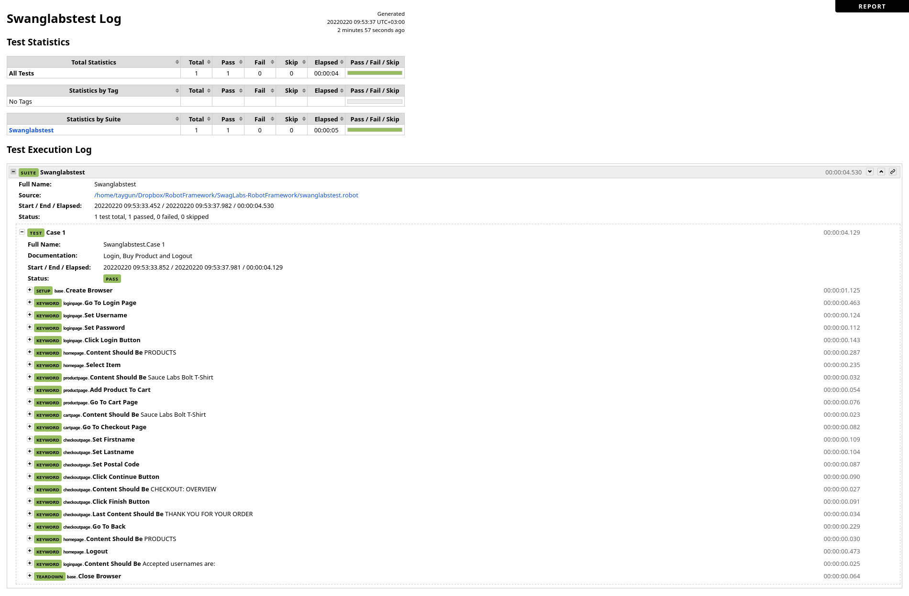

# Testing UI with Robot Framework

[Swag Labs](https://www.saucedemo.com/) was used as the website.

## Project Structure

  - base.robot
  - loginpage.robot
  - homepage.robot      
  - productpage.robot
  - cartpage.robot
  - checkoutpage.robot
  - swanglabstest.robot

**Required Robot Framework Libraries**

- Selenium Library
- Faker Library

**Test Steps and Report**

